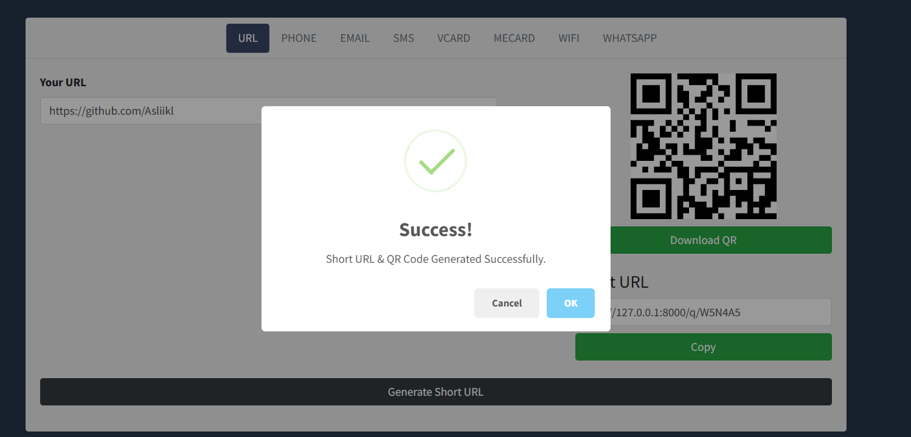
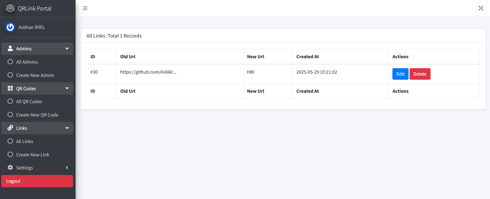
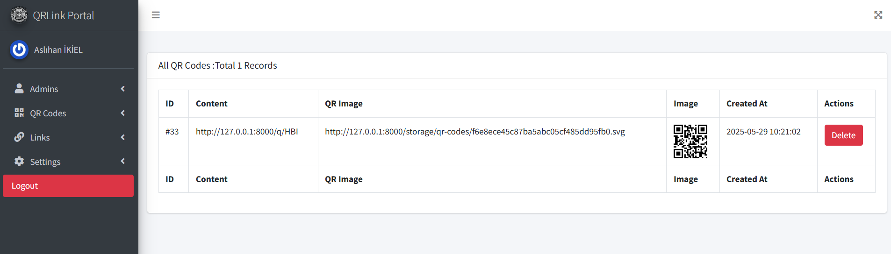

# QR-URL Access

## Proje Hakkında

**QR-URL Access**, farklı veri tipleri için kısa URL ve QR kod oluşturmanıza olanak tanıyan, Laravel tabanlı modern bir web uygulamasıdır. Yönetici paneli sayesinde sistemdeki tüm linkler, QR kodlar ve ayarlar kolayca yönetilebilir.

## Özellikler

- **Çoklu Veri Tipi Desteği:**  
  URL, Telefon, E-posta, SMS, vCard, meCard, WiFi, WhatsApp için kısa link ve QR kod üretimi.
- **Kısa Link Yönlendirme:**  
  Oluşturulan kısa linkler ile hızlı ve güvenli yönlendirme.
- **QR Kod Oluşturucu:**  
  Her veri tipi için otomatik QR kod üretimi ve indirme.
- **Yönetici Paneli:**
    - Kullanıcı ve yönetici yönetimi
    - Link ve QR kod yönetimi
    - Sistem ayarları yönetimi
- **Modern Arayüz:**  
  Kullanıcı dostu ve mobil uyumlu tasarım.
- **Gelişmiş Güvenlik:**  
  Laravel'in güncel güvenlik standartları ile geliştirilmiştir.

## Ekran Görüntüleri






## Kurulum

### Gereksinimler

- PHP 8.1 veya üzeri
- Composer
- Node.js & npm
- MySQL veya benzeri bir veritabanı

### Adımlar

1. **Depoyu klonlayın:**
   ```bash
   git clone <proje-linki>
   cd Qr-Url-Access-master
   ```

2. **Bağımlılıkları yükleyin:**
   ```bash
   composer install
   npm install
   ```

3. **.env dosyasını oluşturun ve yapılandırın:**
   ```bash
   cp .env.example .env
   ```
   Veritabanı ve diğer ayarları `.env` dosyasında düzenleyin.

4. **Uygulama anahtarını oluşturun:**
   ```bash
   php artisan key:generate
   ```

5. **Veritabanı migrasyonlarını çalıştırın:**
   ```bash
   php artisan migrate
   ```

6. **Vite ile ön yüzü derleyin:**
   ```bash
   npm run build
   ```

7. **Uygulamayı başlatın:**
   ```bash
   php artisan serve
   ```

#### Olası Sorunlar

- **Veritabanı bağlantı hatası:**  
  `.env` dosyasındaki DB_ ayarlarını kontrol edin.
- **Ön yüz derlenmiyor:**  
  Node.js ve npm'nin kurulu olduğundan emin olun.

## Kullanım

### Kısa Link ve QR Kod Oluşturma

1. Ana sayfada istediğiniz veri tipini seçin.
2. Formu doldurun ve "Oluştur" butonuna tıklayın.
3. Oluşan kısa linki kopyalayabilir veya QR kodunu indirebilirsiniz.

### Yönetici Paneli

- `/admin/login` adresinden giriş yapabilirsiniz.
- Varsayılan yönetici hesabı ilk kurulumda oluşturulmamışsa, veritabanı üzerinden manuel eklenmelidir.

## SSS

**S: QR kodlar nerede saklanıyor?**  
C: QR kodlar `storage` dizininde saklanır.

## Katkı ve Lisans

- Katkıda bulunmak için lütfen bir pull request gönderin.
- MIT Lisansı ile lisanslanmıştır.
